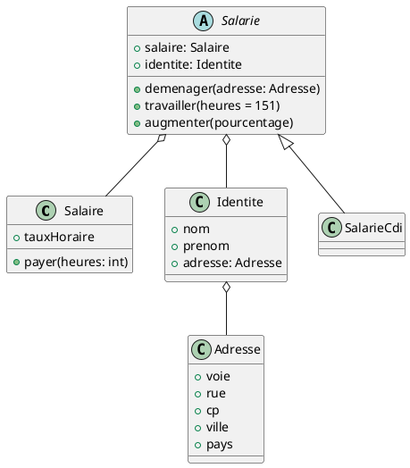

# TP2

Ce projet contient les classes et les tests associés pour modéliser les employés d'une application de gestion de personnel 
Ce TP 2 provient de : https://github.com/Octocorn-Learning/Java-TU-TDD

## Diagramme de classes

## Classes

Le projet comprend les classes suivantes:

**SalarieCdi**: Cette classe représente un employé en CDI. Elle contient des informations sur l'identité de l'employé
et son salaire. Elle possède également l'ensemble des méthodes. 
**Identite**: Cette classe représente l'identité d'un employé. Elle contient des informations telles que le nom, le prénom
et l'adresse de l'employé. 
**Adresse**: Cette classe représente l'adresse d'un employé. 
**Salaire**: Cette classe représente le salaire d'un employé. Elle contient des informations sur le taux horaire et
une méthode pour calculer le montant du salaire.

## Tests

L'ensemble des tests ont été effectués via JUnit 5 pour les tests unitaires et Mockito pour les mocks.

## Auteur 

Ce projet a été développé par [ElmCode](https://github.com/ELMcode).
