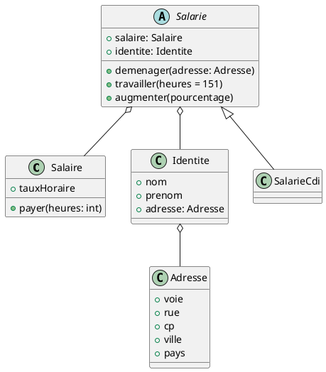

# TP2

## Application Diagram

```plantuml
@startuml

class Salaire {
  +tauxHoraire
  +payer(heures: int)
}

class Identite {
  +nom
  +prenom
  +adresse: Adresse
}

class Adresse {
  +voie
  +rue
  +cp
  +ville
  +pays
}

class SalarieCdi extends Salarie {
}

abstract class Salarie {
  +salaire: Salaire
  +identite: Identite
  +demenager(adresse: Adresse)
  +travailler(heures = 151)
  +augmenter(pourcentage)
}

Salarie o-- Identite
Salarie o-- Salaire

Identite o-- Adresse

@enduml
```

